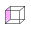
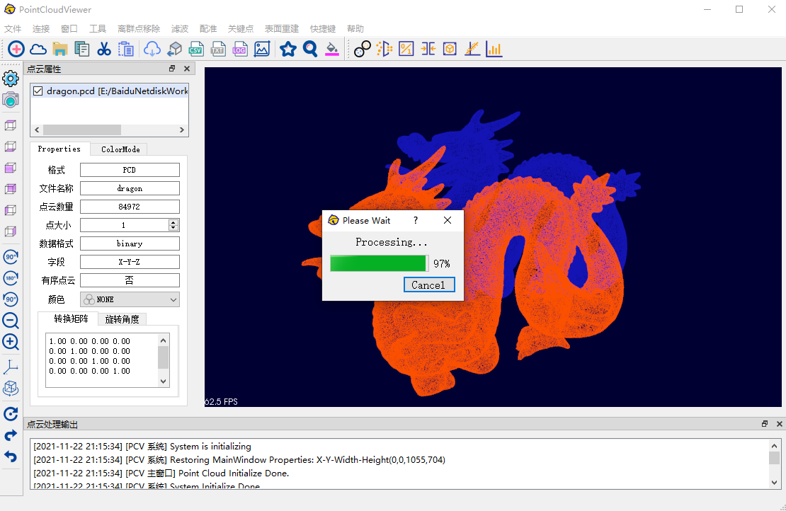

# point-cloud-viewer
Point Cloud Viewer, PCV是一款基于集成点云显示以及点云处理的软件，点云处理功能主要包括以下功能：

1. 点云分割
2. 点云离群点移除
3. 点云滤波
4. 点云配准
5. 关键点提取
6. 点云表面重建
7. 几何属性计算

软件采用Qt设计实现，其界面设计参考Cloud Compare，内核算法基于点云处理工具库PCL实现。具体的设计实现详情见下文。

以下是一些demo：


# 使用教程以及相关工具库

下表为本软件所采用的技术方案，读者如果想要跑通本工程，建议参考下表：

| 序号 | 技术            | 采用方案                 |
| ---- | --------------- | ------------------------ |
| 1    | 编程语言        | C++ 11                   |
| 2    | 点云工具库      | PCL 1.9.1                |
| 3    | 可视化工具库    | VTK 8.1                  |
| 4    | GUI框架         | Qt 5.13.2                |
| 5    | IDE（开发环境） | VS2017+Qt Creator        |
| 6    | 编译器          | MSVC 2017                |
| 7    | 运行环境        | Windows / Linux / Mac OS |

## Step 1 搭建环境

1. 安装PCL 1.9.1，与之对应的VTK版本为VTK 8.1 。为了便于读者复现，原本想把PCL1.9.1的整个工程上传到Github项目中，奈何文件过大无法上传。于是我上传到了[CSDN](https://download.csdn.net/download/luolaihua2018/87714484)，该项目工程中已包含了VTK 8.1，读者可自行获取。
2. 安装 Cmake
3. 安装 Qt
4. 安装 Visual Studio 

## Step 2 使用Cmake构建工程

本项目使用Cmake来构建工程：


其中最重要的是CMakeLists.txt的编写：

```
cmake_minimum_required(VERSION 3.5)

project(PointCloudViewer VERSION 0.1 LANGUAGES CXX)

set(CMAKE_INCLUDE_CURRENT_DIR ON)

set(CMAKE_AUTOUIC ON)
set(CMAKE_AUTOMOC ON)
set(CMAKE_AUTORCC ON)

set(CMAKE_CXX_STANDARD 11)
set(CMAKE_CXX_STANDARD_REQUIRED ON)

find_package (VTK REQUIRED)
IF (VTK_FOUND)
    MESSAGE(STATUS "VTK found.")
    INCLUDE(${VTK_USE_FILE})
ENDIF()

find_package (PCL 1.7.0 REQUIRED)
include_directories(${PCL_INCLUDE_DIRS})
link_directories(${PCL_LIBRARY_DIRS})
add_definitions(${PCL_DEFINITIONS})

find_package(QT NAMES Qt6 Qt5 COMPONENTS Widgets REQUIRED)
find_package(Qt${QT_VERSION_MAJOR} COMPONENTS Widgets REQUIRED)

set(PROJECT_SOURCES
        main.cpp
        pclvisualizer.cpp
        pclvisualizer.h
        pclvisualizer.ui
        # 测试
        inputdialog.h
        inputdialog.cpp
        inputdialog.ui
                images.qrc
		logo.rc

)

if(${QT_VERSION_MAJOR} GREATER_EQUAL 6)
    qt_add_executable(PointCloudViewer
        MANUAL_FINALIZATION
        ${PROJECT_SOURCES}
    )
# Define target properties for Android with Qt 6 as:
#    set_property(TARGET PointCloudViewer APPEND PROPERTY QT_ANDROID_PACKAGE_SOURCE_DIR
#                 ${CMAKE_CURRENT_SOURCE_DIR}/android)
# For more information, see https://doc.qt.io/qt-6/qt-add-executable.html#target-creation
else()
    if(ANDROID)
        add_library(PointCloudViewer SHARED
            ${PROJECT_SOURCES}
        )
# Define properties for Android with Qt 5 after find_package() calls as:
#    set(ANDROID_PACKAGE_SOURCE_DIR "${CMAKE_CURRENT_SOURCE_DIR}/android")
    else()
        add_executable(PointCloudViewer
           # 是否打开控制台
           # WIN32
            ${PROJECT_SOURCES}
        )
    endif()
endif()

target_link_libraries(PointCloudViewer PRIVATE Qt${QT_VERSION_MAJOR}::Widgets ${PCL_LIBRARIES} ${VTK_LIBRARIES})

set_target_properties(PointCloudViewer PROPERTIES
    MACOSX_BUNDLE_GUI_IDENTIFIER my.example.com
    MACOSX_BUNDLE_BUNDLE_VERSION ${PROJECT_VERSION}
    MACOSX_BUNDLE_SHORT_VERSION_STRING ${PROJECT_VERSION_MAJOR}.${PROJECT_VERSION_MINOR}
)

if(QT_VERSION_MAJOR EQUAL 6)
    qt_finalize_executable(PointCloudViewer)
endif()

```

具体的使用方法：

​			

## Step3 使用VS 编写code并编译执行

构建完成后，在输出文件夹里有PointCloudViewer.sln 文件，使用VS打开即可


如果出现无法启动程序的问题，参考博文：

[使用CMake+Visual Studio编译生成的项目出现无法启动程序的问题解决办法](https://blog.csdn.net/luolaihua2018/article/details/118882632?ops_request_misc=%257B%2522request%255Fid%2522%253A%2522168215751816800182135702%2522%252C%2522scm%2522%253A%252220140713.130102334.pc%255Fblog.%2522%257D&request_id=168215751816800182135702&biz_id=0&utm_medium=distribute.pc_search_result.none-task-blog-2~blog~first_rank_ecpm_v1~rank_v31_ecpm-3-118882632-null-null.blog_rank_default&utm_term=vs&spm=1018.2226.3001.4450)

将PointCloudViewer设为启动项目即可：


# 点云处理及三维重建软件(PCV)的设计与实现

@[TOC]

本章将围绕点云处理及三维重建软件(Point Cloud Veiwer, PCV)的总体设计、功能开发以及运行测试而展开。

# 一， 软件总体设计

在对本文点云处理及三维重建软件进行设计之前，需要遵守两个通用的软件设计准则：

1.  稳定性准则。在设计软件时，应在优先考虑稳定性的前提下，再去提高其性能和效率。比如在开发软件时，应尽量选用已经成熟的技术方案以及高效稳健的算法。
2.  可扩展性准则。具有良好的兼容性和可扩展性的软件当面对用户需求增加或者改变时，可以很快地进行升级或者更新，而不是将旧的软件淘汰，重新进行开发。

## 1.1 软件设计流程

图  1为本文点云处理及三维重建软件的设计流程图，一个成熟可靠的软件的设计与实现首先需要完整清晰的设计思路，以及遵守规范的软件系统设计原则。


图  1 点云处理及三维重建软件的设计流程

从图  1中可知本文软件的设计流程主要有6大步骤：

### 需求分析

软件在设计实现之前，必须分析用户需求，即明确当前软件需要实现哪些功能以及需达到的最终效果，以解决用户当前遇到的问题。如表 1所示，为本章所设计实现的点云处理及三维重建软件的需求分析表格。

表 1 点云处理及三维重建软件功能列表

| 序号 | 需求               | 功能描述                                         |
| ---- | ------------------ | ------------------------------------------------ |
| 1    | 点云数据采集       | 与激光雷达建立通信，将采集到的数据保存           |
| 2    | 点云预处理         | 对点云数据进行下采样、去噪和平滑                 |
| 3    | 点云配准           | 将多帧点云数据拼接，生成目标物体的完整的三维模型 |
| 4    | 点云表面重建       | 还原目标物体真实的表面细节特征                   |
| 5    | 点云模型可视化显示 | 对点云模型进行可视化操作（旋转、平移以及缩放）   |
| 6    | 点云模型导出       | 将生成的点云模型导出的多种指定格式               |
| 7    | 点云分割           | 按照点云的不同特征，对点云数据进行分割           |
| 8    | 点云属性计算       | 计算点云的表面积、体积、质心以及外接圆半径等属性 |

### 总体设计

在需求分析后，设计出软件的总体架构，以及确定其各个功能模块。软件的总体架构见图  2。

### 技术选型

开发者根据当前预算、开发周期以及开发者自身的知识储备来选择合适的软硬件环境来进行软件的开发，这个过程称为技术选型。本文根据实际情况，在对当前点云三维重建关键技术进行研判后，为点云处理及三维重建软件的开发所列出的技术选型清单如表 2所示。

表 2 点云处理及三维重建软件技术选型

| 序号 | 技术            | 采用方案                 |
| ---- | --------------- | ------------------------ |
| 1    | 编程语言        | C++ 11                   |
| 2    | 点云工具库      | PCL 1.9.1                |
| 3    | 可视化工具库    | VTK 8.1                  |
| 4    | GUI框架         | Qt 5.13.2                |
| 5    | IDE（开发环境） | VS2017+Qt Creator        |
| 6    | 编译器          | MSVC 2017                |
| 7    | 运行环境        | Windows / Linux / Mac OS |

### 详细设计

通过软件的总体设计与技术选型后，已经初步确定了该软件的技术方向以及功能模块。接下来就是对每个功能模块进行具体的设计。例如模块中算法的设计或选择，操作界面的设计等等。

### 功能实现

通过对软件的详细设计之后，开始对软件的具体功能进行开发实现，主要包括软件界面的开发以及三维重建关键技术相关的算法代码的实现。

### 运行测试

软件开发完成后，需要对软件进行测试，通过使用一些数据量大、表面特性复杂的点云数据作为输入，以测试软件的极限性能。

## 1.2 软件组成结构

图  2为本文所设计的点云处理及三维重建软件的总体架构图，从图中可知，本文软件主要可分为三个功能模块：点云IO模块，点云处理模块以及三维可视化模块。


图  2 点云处理及三维重建软件架构图

下面为这三个主要功能模块进行简短的说明介绍：

### 点云IO模块

点云IO(Input / Output)模块主要负责点云数据的读取、转换以及保存。值得一提的是，本文软件有两种点云读取方式：一是与激光雷达建立通信，实时读取激光雷达扫描得到的点云数据，并在本地另存，目前支持的激光雷达品牌有Velodyne和镭神。二是直接读取现有的点云数据文件，本文软件目前支持的文件格式有：PCD、PLY、STL、PCAP、TXT以及OBJ等6种格式，并支持这些格式的相互转换。

### 点云处理模块

点云处理模块是本文软件的核心功能模块，它具有五大主要功能：点云预处理、点云配准、表面重建、点云分割以及点云属性提取。其中，点云预处理、点云配准以及表面重建等功能属于基于激光雷达的三维重建的关键技术，是本文的研究重点，其中不仅融合了本文提出的各种改进算法，还集成了大量的国内外经典的点云处理算法。算法的选择具有较高的自由度，便于用户根据待重建目标点云的实际情况，选择合适的算法进行三维重建。此外，点云分割以及点云属性提取为在三维重建技术的基础上进行拓展，而开发的功能，用于辅助用户解决在三维重建中的遇到的各种问题，比如对目标点云进行分割提取，获取点云的具体几何属性等。

### 三维可视化模块

三维可视化模块主要包含可视化界面、可视化显示以及可视化操作等功能。可视化界面由主窗口、点云属性窗口、点云处理控制台窗口、工具栏、菜单栏等五部分组成，其界面设计友好，易用性强。点云的可视化显示与操作功能通过QVTKWidget插件，将三维重建过程中产生的结果进行实时可视化，并可以任意旋转、缩放、平移以及改变点云颜色，以便于用户更加细致地观察点云模型。

## 1.3 软件工作流程

基于点云处理及三维重建软件的三个主要功能模块，其工作流程如图  3所示：


图  3 点云处理及三维重建软件工作流程图

从图  3中可知，本章软件的主要工作流程有以下步骤：

- 步骤1：读取点云数据。本文软件支持多达6种格式的点云数据。

- 步骤2：点云格式转换。不同格式的点云文件携带的点云信息各有不同，为了能进行高效的点云处理及三维重建，用户可以将点云格式进行转换，删除冗余数据，只保留点云处理过程中需要的信息（如描述数据点的XYZ坐标，RGB颜色信息等）。

- 步骤3：点云处理及三维重建。将点云数据进行预处理、点云配准以及点云表面重建等操作。从而将原始的由离散数据点构成的点云图像转换成能展现目标物体表面细节特征的三维模型。并且还可以对点云进行点云分割和点云属性计算，以提取其他有效信息。

- 步骤4：三维可视化显示与操作。用户可以通过对点云模型进行旋转、平移以及缩放等操作，可以全方位地观察三维模型。

- 步骤5：保存三维模型。用户可以选择将重建好的三维模型保存成不同格式的三维模型。

# 二，软件开发平台及功能介绍

## 2.1 软件开发平台

### 集成开发环境

本文所设计的点云处理及三维重建软件主要基于Microsoft Visual Studio 2017以及Qt Creator两个集成开发环境，来完成代码的编写、分析、编译以及调试工作。此外，本文主要基于Qt框架来完成软件界面的设计以及内部逻辑功能的实现，Qt具有一套代码，多平台运行的特点，因此使用此框架开发的软件不仅能够在Windows和Linux等操作系统上运行，还能在MacOS上运行。也正是因为Qt的跨平台开发的特性，也使得本章所设计的软件可以在多个操作系统中正常运行。不仅如此，Qt还可以结合PCL进行开发，通过使用QVTKWidget插件，可以开发处具有GUI的点云处理软件。Qt使用的集成开发环境为Qt Creator，本章主要使用此IDE完成软件UI的设计。

### PCL点云数据处理库

点云库(Point Cloud Library)简称PCL，它同样具有跨平台开发的特性，采用BSD开源协议，不仅允许开发者在PCL工具库的基础上进行二次开发，而且还鼓励国内外学者们将自己的点云数据相关研究成果以代码的形式共享出来。因此，PCL中大量地集成了国内外点云数据获取及处理的通用算法以及高效的点云相关数据结构。常用的算法模块有：表面重建模块、点云滤波模块以及点云配准模块。常用点云相关数据结构有OC-TREE和KD-TREE等。本文中的大部分算法实现均以PCL工具库为基础，在其提供的算法源码上进行改进优化，此外本文所使用的可视化类为pcl∷PCLVisualizer，并通过重新编译视觉化工具库(Visualization Toolkit, VTK)源码，生成与PCL对应版本的QVTKWidget插件，装载在基于Qt的可视化软件中用以显示点云处理结果。

### 编译配置工具CMake

 CMake是一款高级编译（安装）配置工具，它同样支持跨平台的特性，因此可以根据当前选择的平台（如VS2017）以及编译器（如MSVC或MinGW等）输出对应的Makefile文件或Project文件。CMake的使用比较简单，只需要在其组态档（一种构建项目专用的CMake脚本）中编写配置环境变量以及依赖库的命令语句即可。CMake的组态档以CMakeLists.txt命名。本文中使用的PCL、VTK以及Qt均使用CMake工具进行编译环境的配置。


图  4 PCL功能模块

## 2.2 软件主界面设计

图  5为本文软件启动时的加载页面，软件主界面的布局如图  6所示，其参考了国外的开源点云处理软件Cloud Compare，除此之外，本文软件的内部逻辑功能及各种算法的具体实现均由本文独立设计开发。从图  7可知，软件共有六大功能区，分别是：菜单栏、点云处理工具栏、点云视图操作工具栏、点云属性窗口、点云显示主窗口以及操作记录窗口。

|  图  5软件加载页面 |  图  6软件主界面 |
| ------------------------------------------------------------ | ------------------------------------------------------------ |


图  7软件主界面详解

### 菜单栏

本文软件的菜单栏中共有13个菜单，如图  8所示，除了点云处理相关功能菜单外，菜单栏中还有文件菜单栏和快捷键菜单栏等提高软件使用效率的功能。图  9为软件中与点云文件处理相关的菜单示意图，不仅支持各种格式点云的导入导出，还支持将点云处理日志导出。图  9为软件中的快捷键菜单，用户既可以点击菜单项也可以之间按下快捷键，来运行软件的某些功能，如屏幕快照、数据点大小设置以及点云视图缩放等。


图  8软件菜单栏

|  文件菜单 |  快捷键菜单 |
| ------------------------------------------------------------ | ------------------------------------------------------------ |

图  9 文件菜单及快捷键菜单

### 工具栏

用户既可以在菜单栏中点击相应的菜单项来运行具体功能，也可以通过点击工具栏中的图标按钮进行快速操作。软件工具栏有两个，图  10为可视化操作工具栏， 表 3为工具栏各按钮图标的功能释义。通过点击其中的按钮，可以快速地操作点云视图，比如有快速查看目标点云的六视图、点云旋转固定角度以及点云缩放等操作。图  11为软件算法工具栏，表 4为算法工具栏各按钮图标的功能释义，算法工具栏中涵盖了点云处理相关操作功能，比如有点云的复制粘贴、点云导出以及点云三维重建相关的快捷操作等操作。


图  10软件可视化操作工具栏


图  11软件算法工具栏

表 3 软件可视化操作工具栏图标功能详解

| 序号 | 图标                                                         | 功能     | 序号 | 图标                                                         | 功能       |
| ---- | ------------------------------------------------------------ | -------- | ---- | ------------------------------------------------------------ | ---------- |
| 1    |  | 系统设置 | 9    |  | 旋转90度   |
| 2    |  | 相机视角 | 10   |  | 旋转180度  |
| 3    |  | 上视图   | 11   |  | 旋转270度  |
| 4    |  | 下视图   | 12   |  | 添加坐标轴 |
| 5    |  | 左视图   | 13   |  | 顺时针旋转 |
| 6    |  | 右视图   | 14   |  | 恢复初始值 |
| 7    |  | 前视图   | 15   |  | 撤销操作   |
| 8    |  | 后视图   | 16   |  | 重做操作   |

表 4 软件算法工具栏图标功能详解

| 序号 | 图标                                                         | 功能       | 序号 | 图标                                                         | 功能           |
| ---- | ------------------------------------------------------------ | ---------- | ---- | ------------------------------------------------------------ | -------------- |
| 1    |  | 工作台新增 | 13   |  | 导出为CSV      |
| 2    |  | 点云添加   | 14   |  | 导出为TXT      |
| 3    |  | 文件打开   | 15   |  | 导出处理日志   |
| 4    |  | 点云复制   | 16   |  | 屏幕快照       |
| 5    |  | 点云剪切   | 17   |  | 点云收藏       |
| 6    |  | 点云粘贴   | 18   |  | 点云搜索       |
| 7    |  | 点云导出   | 19   |  | 主窗口背景颜色 |
| 8    |  | 模型导出   | 20   |  | 使用手册       |
| 9    |  | 点云滤波   | 21   |  | 关键点提取     |
| 10   |  | 点云配准   | 22   |  | 离群点移除     |
| 11   |  | 表面重建   | 23   |  | MLS拟合        |
| 12   |  | 直方图     | 24   |  | KD-TREE        |

### 点云属性窗口以及主窗口

图  12右侧为点云主窗口，用于显示当前加载的点云文件，不仅可以使用鼠标对目标点云进行拖拽、缩放以及旋转等操作，还可以在窗口中添加坐标轴和标尺等工具，便于对目标点云进行可视化操作。图  12左侧为点云属性主窗口，通过此窗口，可知软件当前加载以及选中的点云文件的具体属性，如文件格式、文件名称、点云数量、数据格式以及所含字段等信息。


图  12 点云属性窗口及主窗口

### 点云处理记录窗口

由于点云处理的相关步骤较多，为了使用户在点云处理过程中步骤更加清晰明了，本文软件特别设置了一个点云处理记录窗口，用于记录当前点云操作的具体详情，如图  13所示，每条记录主要有三部分组成：操作时间、操作结果以及操作详情。不仅如此，点云处理记录还支持一键导出，方便用户对点云处理中各流程进行记录和分析。


图  13软件点云处理记录窗口

### 软件相关数据结构

本文所设计的点云处理及三维重建软件不仅支持直接读取点云数据进行处理，也可以实时读取激光雷达所扫描到的点云数据，并保存到本地。以Velodyne激光雷达为例，上位机与激光雷达建立网络通信后，本文软件将持续性地读取Velodyne激光雷达发送过来的UDP报文，并将UDP报文解析，并以PCAP文件的形式将原始的点云数据保存到本地，PCAP的文件结构如图  14。PCAP文件中保存的是点云数据流，换言之，一个PCAP文件中包含了多帧的点云图像，每帧点云图像数据都有自己的数据头部(Packet Header)以及时间戳(Timestamp)。在实际的点云处理过程中，并不需要多帧重复的点云图像，因此，只需要在PCAP文件中提取其中一帧点云图像，并将冗余的信息移除，即可得到描述目标物体的关键帧点云图像。单帧的点云图像根据其用途以及处理方式的不同，其存储方式有很多，常见的比如有PCD、PLY以及STL格式。


图  14 PCAP文件结构

由于本文软件是基于PCL工具库而设计开发的，而PCL不但对PCD格式的兼容度最高，而且对PCD文件的读写速度也比其他格式要快，所以本软件也选择PCD格式作为点云数据读写的首要格式。在PCD文件的头部（前10行），都必须先声明当前点云数据的各种属性，属性包含10个字段，每个字段占一行，表 5所示为PCD各个字段的意义说明。从FIELDS字段中可以知道当前点云每个数据点所包含的信息，从表 5中可以看到，例如 ，则说明每个数据点包含坐标信息，若是，则说明每个数据点除了坐标信息外，还包含每个点云颜色属性(RGB)。此外POINTS、WIDTH以及HEIGTH字段有 的关系，若当前点云为无序点云，则HEIGTH的值为1，WIDTH也可以表示当前点云中点的个数。DATA字段之后的内容为点云的数据部分，在.7版本的PCD中，支持格式和格式。需要注意的是，PCD文件中各个字段有严格的顺序要求且不能缺失，必须按照表 5所示顺序进行描述。

表 5 PCD文件字段含义

| 序号 | 字段      | 字段含义                       | 示例    |
| ---- | --------- | ------------------------------ | ------- |
| 1    | VERSION   | PCD文件版本                    | .7      |
| 2    | FIELDS    | 点数据的维度和内容             | x y z   |
| 3    | SIZE      | 每一个维度的字节数             | 4 4 4   |
| 4    | TYPE      | 每一个维度的类型               | F F F   |
| 5    | COUNT     | 每一个维度包含的元素数目       | 1 1 1   |
| 6    | WIDTH     | 点云数据集的宽度               | 56258   |
| 7    | HEIGTH    | 点云数据集的高度               | 1       |
| 8    | VIEWPOINT | 点云的获取视点                 | 0001000 |
| 9    | POINTS    | 点云中点的数目                 | 56258   |
| 10   | DATA      | 点云数据的数据类型，包括格式和 |         |

# 三，软件点云处理相关功能

在上文图  2中的软件组成结构中提到了点云处理模块，其中点云处理模块包含了五大功能：点云预处理、点云配准、点云表面重建、点云分割以及点云属性提取。除了点云预处理、点云配准和表面重建等三维重建相关功能外，本文软件还以此为基础，拓展了点云分割和点云属性提取等功能。点云处理相关功能是本文软件的核心功能，其中涵盖了本文改进算法在内的国内外优秀点云处理相关算法78个，相关功能函数多达156个。并且每种点云处理算法都可独立设置输入参数，不同算法间可自由搭配使用。下面将对每个功能进行详细介绍。

## 3.1 点云预处理功能

点云预处理功能主要包括三部分：点云采样、点云离群点移除、点云滤波等。本文软件在点云采样功能中集成了基于体素栅格的下采样、均匀采样以及增采样在内的5种算法。如图  15(a)所示，此外还有KD-TREE、OC-TREE以及法线估计等功能。对于离群点移除功能，如图  15(b)所示，本文软件集成了基于统计、基于密度、基于聚类的DBSCAN离群点移除算法。此外，本文软件的点云滤波功能集成了高斯滤波、平均滤波以及拉普拉斯滤波在内的9种点云滤波方法，用户可以根据当前点云的实际情况选择合适的滤波方法。此外，该菜单中还有“一键移除”和“一键滤波”等功能，该功能可以使用预先设置好的算法以及算法参数对点云进行快速处理。

|  工具菜单 |  离群点移除功能菜单 |  滤波功能菜单 |
| ------------------------------------------------------------ | ------------------------------------------------------------ | ------------------------------------------------------------ |

图  15点云预处理相关功能菜单

## 3.2 点云配准功能

点云配准相关功能包括关键点提取算法以及点云配准算法。如图  16(a)所示,为关键点提取相关功能菜单，本文软件集成了Agast关键点、Harris关键点、ISS关键点以及SIFT关键点在内的8种关键点提取算法。而图  16(b)为点云配准相关的功能菜单，从图中可知，本文软件集成了ICP、NDT、Super 4PCS以及本文改进的基于ISS关键点的Super 4PCS算法在内的9种配准算法。此外，对于关键点提取和和配准，本文软件也设置了“一键提取”和“一键配准”等快捷功能。

|  |  |
| ------------------------------------------------------------ | ------------------------------------------------------------ |

图  16 点云配准相关功能菜单

## 3.3 点云表面重建功能

图  17为本文软件点云表面重建相关的功能菜单，本文软件支持MLS、泊松算法、贪婪投影三角化算法以及本文提出的改进贪婪投影三角化算法在内的8种表面重建算法，并且还支持“一键重建”的快捷功能。此外本文软件还可以将重建好的三维模型导出为OBJ、STL以及PLY等格式的文件，可广泛用于3D打印等其他应用场景。

## 3.4 点云分割功能

本文软件的点云分割功能集成了平面分割、圆柱体分割、欧式距离分割以及基于颜色的分割等算法在内的10种点云分割算法，软件的点云分割功能菜单如图  18所示。点云分割的目的是从含有多目标的点云数据中，提取用户所需的目标点云。用户可以根据点云的不同属性对目标点云采用不同的分割算法，点云分割完成后可将分割得到的不同子点云分别进行保存，以便进行下一步的处理。

|  |  |
| ------------------------------------------------------------ | ------------------------------------------------------------ |

### 点云属性计算功能

本文软件的几何属性提取功能菜单如图  19所示，软件可以计算目标点云的表面积、体积、外接圆、质心、密度以及协方差矩阵等几何属性，这些属性可以自由选择进行提取计算，也可以点击菜单中“一键提取”菜单项，将目标点云是所有属性全部计算出来。值得一提的是，本文软件中关于表面积和体积的计算功能，需要在目标点云进行表面重建后，才能进行计算。

|  |  |
| ------------------------------------------------------------ | ------------------------------------------------------------ |
|  AABB包围盒示意图 |  OBB包围盒示意图 |

图  19 点云属性计算功能菜单

该功能不仅能计算目标点云的表面积，还能得出重建表面的最大单元面积和最小单元面积。事实上，经过表面重建后的曲面是由若干个单元面片拼接而成，比如使用贪婪投影三角化表面重建算法生成的曲面，就是由若干个单元三角形面片拼接而成。此外，本文软件除了能计算目标点云的实际体积外，还能计算目标点云的轴对齐包围盒(AABB)体积以及有向包围盒(OBB)体积，AABB包围盒和OBB包围盒的示意图如图  19(c)和图  19(d)所示，这两种体积的求取对真实目标物体的包装运输有一定的现实意义[78]。

# 四，软件运行和测试

本节将使用本文开发的点云处理及三维重建软件对不同场景的点云数据进行点云处理预处理实验、点云配准实验、点云表面重建实验、点云分割实验以及点云属性计算实验，以验证本文软件的有效性和实用性。图  20为选取的两个主要的实验点云图像，图  20(a)为桌子的点云图像，该点云图像数据量较大，有460400个数据点。从图像中可以看出，该点云中含有较多的离群噪声点，且点云空间不闭合，对此类点云进行三维重建的难度较大。图  20(b)为中国龙的点云图像，该点云数据量也较大，共有437645个数据点，与图  20(a)不同，该点云的空间特性呈闭合形态，但是该点云表面曲率复杂且变化大，有较多的凸起区域，对其进行三维重建同样也有较大难度。


图  20 实验点云对象

## 4.1 点云预处理功能测试

如图  21(a)和图  21(b)所示，为使用本文软件对两个点云图像进行加载显示的主界面。然后点击软件功能按钮，对当前点云图像进行离群点移除（使用KD-TREE加速的KANN-DBSCAN离群点移除算法）、滤波平滑（高斯滤波）以及下采样（基于体素的下采样）等预处理操作。图  21(c)和图  21(d)为软件处理点云时的工作示意图。图  21(e)和图  21(f)为点云预处理之后的结果。从图中可以看到，本文软件不仅将两幅点云图像中的离群点移除干净，还使得点云数据在保留其表面特征的前提下，其点云规模得到极大的精简。从表 6中可以看到，对桌子点云的点云预处理时间为1955 ms，点云精简率为0.07。中国龙点云的处理时间为1373 ms，其精简率为0.055。虽然两点云图像点云规模都从十万级精简到了万级，但是点云的轮廓特征并没有受到影响。

|  桌子点云图像加载完成 |  中国龙点云图像加载完成 |
| ------------------------------------------------------------ | ------------------------------------------------------------ |
|  桌子点云图像预处理中 |  中国龙点云图像预处理中 |
|  桌子点云图像预处理完成 |  中国龙点云图像预处理完成 |

图  21 软件点云预处理示意图

表 6 点云预处理实验结果

| 序号 | 点云名称 | 预处理前点云数量 | 预处理后点云数量 | 处理时间（ms） | 精简率 |
| ---- | -------- | ---------------- | ---------------- | -------------- | ------ |
| 1    | 桌子     | 460400           | 32306            | 1955           | 0.070  |
| 2    | 中国龙   | 437645           | 24147            | 1373           | 0.055  |

## 4.2 点云配准功能测试

原始点云数据经过点云预处理操作之后，即可被用来进行点云配准实验。首先将两帧不同位置的点云数据读取到软件中，如图  22所示，图  22(a)为桌子点云的两帧处于不同位姿的点云图像，图  22(b)为中国龙在不同位姿下的两帧点云。通过点击软件上的功能按钮，选择配准算法，进行配准实验。如图  22(c)和图  22(d)所示，为软件正在进行配准工作的示意图。配准结果见图  22(e)和图  22(f)，可以看到红色和蓝色的两帧点云几乎完全重合，点云间的重合度越高，点云配准效果越好。在软件中的点云属性窗口可以看到当前源点云（红色）到目标点云（蓝色）的转换矩阵：


表 7所示为点云配准的结果分析表格,上文提到过FitnessScore越小，代表两帧点云之间的距离越近，重合度越高，如果FitnessScore为0则说明两帧点云完全重合，从表中可知，桌子点云经过迭代配准11次后，其配准得分为，而中国龙经过15次迭代配准后，其配准得分为。两点云的配准得分都近似为0，说明配准效果较为精确。

|  桌子源点云和目标点云 |  中国龙源点云和目标点云 |
| ------------------------------------------------------------ | ------------------------------------------------------------ |
|  桌子点云图像配准中 |  中国龙点云图像配准中 |
|  桌子点云图像配准完成 |  中国龙点云图像配准完成 |

图  22 点云配准实验示意图

表 7 点云配准实验结果

| 序号 | 点云名称 | 迭代次数 | 处理时间（ms） | FitnessScore                                                 |
| ---- | -------- | -------- | -------------- | ------------------------------------------------------------ |
| 1    | 桌子     | 11       | 1069           |  |
| 2    | 中国龙   | 15       | 1585           |  |

## 4.3 点云表面重建功能测试

点云配准成功后，通过点击软件中的功能按钮，选择贪婪投影三角化表面重建算法，对两个目标点云分别进行表面重建。图  23 (a)和图  23 (b)为本文软件正在进行表面重建的工作示意图。图  23 (c)和图  23 (d)为经过软件表面重建后的三维模型，可以看到重建效果较好，不仅无虚假曲面生成，也没有产生曲面空洞。图  24为点云三维重建前后的对比图，从对比图中可知，即使是未闭合的曲面或者是点云表面含有大量的细节特征，本文提出的改进的表面重建算法都能很好地对点云表面细节进行还原重建。

|  桌子点云图像表面重建中 |  中国龙点云图像表面重建中 |
| ------------------------------------------------------------ | ------------------------------------------------------------ |
|  桌子点云图像表面重建完成 |  桌子点云图像表面重建完成 |

图  23 软件表面重建实验示意图

|  桌子点云原始局部图 |  桌子点云三维重建后局部图 |
| ------------------------------------------------------------ | ------------------------------------------------------------ |
|  中国龙点云原始局部图 |  中国龙点云三维重建后局部图 |

图  24 点云表面重建前后对比

## 4.4 点云分割功能测试

本文软件的点云分割功能集成了10种不同类型的点云分割算法，比如平面分割、圆柱体分割、欧式距离分割以及区域生长分割等等，不同的分割算法适用于不同的点云场景以及分割需求。由于本文篇幅有限，本小节只选取软件中的点云平面分割功能以及圆柱体分割功能进行测试。


图  25 对桌子点云进行平面分割

|  平面分割效果 |  分割所得平面1 |
| ------------------------------------------------------------ | ------------------------------------------------------------ |
|  将平面抽取后的点云 |  分割所得平面2 |

图  26桌子点云平面分割结果示意图

图  25为本文软件对桌子点云进行平面分割的示意图，从图中可知，软件在桌子点云图像中搜索到两个平面，并分别用红色和绿色进行标记，设红色的为平面1，绿色的为平面2。点击“确定”按钮即可将搜索得到的点云平面进行提取，并另存到本地。如图  26所示，为桌子点云的分割结果，图  26(a)为点云分割的效果图，图  26(b)和图  26(d)为本文软件从桌子点云中进行平面分割得到的平面1和平面2，将两个平面抽取出后的结果如图  26(c)所示，可见两个平面均被完整地抽取。不仅如此，平面在三维空间中的方程如式(5.1)所示[79]：


根据此公式可以分别拟合得到平面1和平面2在三维点云空间中的平面方程，两平面方程参数见表 8：

表 8 桌子点云平面分割数据结果

| 序号 | 点云名称 | 参数A       | 参数B     | 参数C     | 参数D     |
| ---- | -------- | ----------- | --------- | --------- | --------- |
| 1    | 平面1    | -0.0027061  | -0.865354 | -0.501154 | -0.494968 |
| 2    | 平面2    | -0.00651102 | -0.87519  | -0.483735 | -1.17735  |

此外，本文软件还可以对点云数据进行多重分割，即通过使用不同的点云分割算法依次对点云进行分割处理。图  27(a)为另一个用于点云分割测试的原始点云数据俯视图，图  27(b)为其侧视图，从两图中可知，该点云图像所描述的场景为：一个水杯放置在桌子平面上，其中水杯带有一个半圆形的水杯把。从整体的视角可以发现，原始点云中包含了一个平面（桌子）和一个圆柱体（水杯）。

|  待分割点云图像俯视图 |  待分割点云图像侧视图 |
| ------------------------------------------------------------ | ------------------------------------------------------------ |
|  平面分割结果 |  圆柱分割结果 |

图  27 平面分割和圆柱体分割处理

使用本文软件对该原始点云依次进行平面分割和圆柱体分割。平面分割结果如图  27(c)所示，图  27(d)为圆柱体分割结果。从平面分割结果中可以看到，本文软件可以完整地将点云平面提取出来。从圆柱体的分割结果中，可见水杯的圆柱体被完整的提取出，并且没有将水杯把提取。此外，圆柱体在三维点云空间中的方程如式(5.2)所示：


其中，为圆柱轴线C上任意一点，为轴线C的方向向量，为圆柱的半径。根据此公式可以得到拟合出圆柱体方程参数为：

此外根据式(5.1)，可以得到平面方程参数为：

## 4.5 点云属性计算功能测试

本文软件的点云属性计算功能支持计算点云的表面积、体积、外接圆、点云质心在内的6种属性，本次测试将主要对表面积和体积两种属性的计算而展开。

|  中国龙点云属性计算示意图 |  中国龙点云属性计算结果 |
| ------------------------------------------------------------ | ------------------------------------------------------------ |

图  28中国龙点云属性计算

|  猴子点云属性计算示意图 |  猴子点云属性计算结果 |
| ------------------------------------------------------------ | ------------------------------------------------------------ |

图  29猴子点云属性计算

图  28(a)为对中国龙点云的表面积体积计算的软件工作示意图，图  28(b)为表面积和体积的计算结果，从结果中可知，中国龙点云的表面积为0.0725956平方米，其体积为0.00478281立方米，并且其AABB包围盒体积为0.00271155立方米，OBB包围盒体积为0.00298459立方米。图  29 (a)则是软件对猴子点云进行表面积和体积计算的工作图，从计算结果图  29(b)中可知，猴子点云的表面积为10.7531平方米，其体积为2.45824立方米，并且其AABB包围盒体积为8.14628立方米，OBB包围盒体积为8.11579立方米。

# 五，总结

本文软件有点云IO、点云处理以及三维可视化等三大功能模块，其中共有12个主要功能。然后介绍本文软件具体的功能开发，其中包括软件的开发平台，主界面设计、软件相关数据结构以及点云处理相关功能等。点云处理相关功能是本文软件的核心功能，其中涵盖了本文改进算法在内的国内外优秀点云处理相关算法78个，相关功能函数多达156个。不仅如此，每种点云处理算法都可独立设置输入参数，不同算法间可自由搭配使用，用户对算法的选择自由度较高。最后使用不同的点云数据对软件进行点云预处理、点云配准、点云表面重建、点云分割以及点云属性计算等功能进行测试，软件测试结果表明，本章所设计开发的软件具有较高的实用性。
